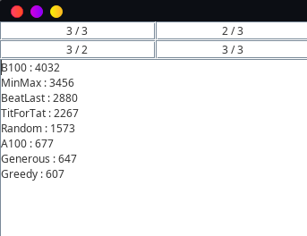

# Strategy Tournament Simulator for *Universal Paperclips*

This repository contains a Java application — **including full source code** — that simulates strategy tournaments inspired by the Prisoner’s Dilemma mechanics found in the game *Universal Paperclips*.  
The program evaluates which strategies are most likely to win under a given payoff matrix.

The GUI lets you modify the payoff values in real time and instantly observe how strategy rankings change.

---

## 📸 Screenshot



---

## 🚀 Features

- **Real-time tournament simulation** (refresh every 0.5s)
- **Interactive 2×2 payoff matrix** identical to the one in *Universal Paperclips*
- **Simple input:**
  - Type only the **left value** of a payoff cell (e.g., `3`)
  - Press **Enter**
  - The application automatically fills in the format `3 / 3`
- **Automatic tournament reruns** whenever a payoff value changes
- **Live strategy ranking**, sorted by current tournament score
- Includes several classic strategies:
  - B100  
  - MinMax  
  - BeatLast  
  - TitForTat  
  - Random  
  - A100  
  - Generous  
  - Greedy  


The tournament includes randomized elements, so rankings may fluctuate slightly with each cycle.

---

## 🏁 Run the Application

A runnable JAR is included:

```bash
java -jar strategytournament.jar

```

Requires Java 8 or later.

No installation is needed — launching the JAR opens the GUI.
## 📂 Source Code

All Java source files are provided directly in this repository.
You are free to inspect, modify, reuse, or rebuild the project.


## 🖥️ How to Use the Application

### 1. Enter payoff values  
The top of the GUI displays a **2×2 payoff matrix**.

To fill a cell:

1. Click the cell  
2. Type the **left number only** (e.g., `3`)  
3. Press **Enter**  
4. The program automatically formats it as `3 / 3`

### 2. Observe live results  
Every 0.5 seconds, the simulator:

- runs a full round-robin tournament  
- recalculates each strategy’s score  
- updates the sorted leaderboard  

This makes it easy to experiment with different payoff values and observe how strategy rankings evolve.

---

## 🎮 Purpose

This project is useful for:

- Players optimizing strategy tournaments in *Universal Paperclips*  
- Students learning about game theory or the Iterated Prisoner’s Dilemma  
- Developers experimenting with adaptive or stochastic simulations  
- Anyone curious about how payoff changes shape strategic behavior  

---

## License
This project is licensed under the MIT License – see the [LICENSE](./LICENSE) file for details.


